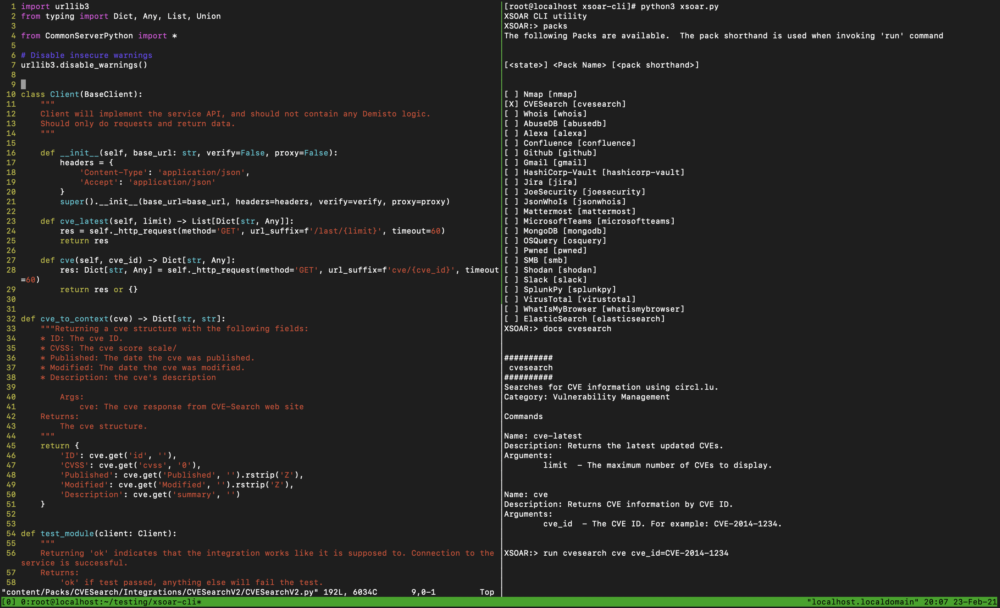

# XSOAR Command Line Interface
#### The XSOAR Universal CLI
The XSOAR CLI is designed to be a universal cyber security multi tool.
This repo leverages the Demisto content repo [demisto content](https://github.com/demisto/content) where enterprise grade automation content is being built and maintained.
These automation scripts and integrations, combined with the XSOAR CLI make utilizing a vast array of 3rd party and open source APIs from a single CLI possible.



#### Prerequisites
1. Install python 3.7 or 3.8. 
2. Clone this repo with `git clone https://github.com/nericksen/xsoar-cli.git`.
3. Change directory into the CLI repo `cd xsoar-cli`.
4. Clone the content repo into the same directory `git clone https://github.com/demisto/content.git`.


Recomended to use `pyenv` or another Python versioning tool.

Install `virtualenv` or someother Python virtual environment tool.

For example

`pip install virtualenv`

Create a virtual env with `virtualenv venv`.

Activate the virtualenv with `source ./venv/bin/activate`

Clone the Demisto content repo into the same directory as the XSOAR CLI.


#### Requirements
Install Python3 requirements with `pip install -r requirements.txt`

Install docker engine according to  [here](https://docs.docker.com/get-docker/).

API keys to 3rd party systems you already own or are open source.

## Documentation
For writing code and contributing, the main XSOAR content documentation can be located at: https://xsoar.pan.dev/

Once the dependencies are installed you can run the XSOAR CLI from the root directory of this repository with

```
python3 xsoar.py
```

You will then be presented with the XSOAR prompt where you can enter CLI commands

### Basic Usage
Packs are groups of content around various use cases and 3rd party tools.
Integrations are the fundamental connectors to these 3rd party services
and facilitate the authentication and CRUD operations with security tools' APIs.
Integrations are included in content packs and are the current focus of the XSOAR CLI.

Start by viewing the currently available Packs by running `packs` or type `help` to view all available commands.

```
XSOAR:> packs
The following Packs are available.  The pack shorthand is used when invoking 'run' command


[<state>] <Pack Name> [<pack shorthand>]


[ ] Nmap [nmap]
[ ] CVESearch [cvesearch]
[ ] Whois [whois]
[ ] AbuseDB [abusedb]
[ ] Alexa [alexa]
[ ] Confluence [confluence]
[ ] Github [github]
[ ] Gmail [gmail]
[ ] HashiCorp-Vault [hashicorp-vault]
[ ] Jira [jira]
[ ] JoeSecurity [joesecurity]
[ ] JsonWhoIs [jsonwhois]
[ ] Mattermost [mattermost]
[ ] MicrosoftTeams [microsoftteams]
[ ] MongoDB [mongodb]
[ ] OSQuery [osquery]
[ ] Pwned [pwned]
[ ] SMB [smb]
[ ] Shodan [shodan]
[ ] Slack [slack]
[ ] SplunkPy [splunkpy]
[ ] VirusTotal [virustotal]
[ ] WhatIsMyBrowser [whatismybrowser]
[ ] ElasticSearch [elasticsearch]

```

Enabling a pack allows for entering the parameters needed for authenticating to the 3rd party service and can be performed with `enable`.

```
XSOAR:> enable
Enable a pack by entering its <Pack Name> listed by 'packs' command
Which Pack should be enabled? Whois
Enter integration parameters: 

No description available

Hint Enter for default value (None)

with_error: 
No description available

Hint Enter for default value (None)

proxy_url: 
{}
```
You can specify to use the local credential vault on the xsoar instance to store sensitive data
for integrations that support credentials. Pass the `LOCAL_VAULT=true` flag to the `enable` command. 
This will disable running commands locally, but is more secure as the cleartext credentials are not stored locally. 

If the pack does not following the standard XSOAR naming conventions it may not be located, in which case you can run `enable` command again with `SAFE_MODE=true`.

```
XSOAR:>enable SAFE_MODE=true LOCAL_VAULT=true
```

Once the pack is enabled you can run its commads using the `run` command.
```
XSOAR:> run whois whois query=ask.com

status: 
clientUpdateProhibited (https://www.icann.org/epp#clientUpdateProhibited)
 clientTransferProhibited (https://www.icann.org/epp#clientTransferProhibited)
 clientDeleteProhibited (https://www.icann.org/epp#clientDeleteProhibited)
 serverUpdateProhibited (https://www.icann.org/epp#serverUpdateProhibited)
 serverTransferProhibited (https://www.icann.org/epp#serverTransferProhibited)
 serverDeleteProhibited (https://www.icann.org/epp#serverDeleteProhibited)

updated_date: 
datetime.datetime(2019, 3, 5, 10, 59, 3)

contacts: 
admin: 
country: US
 state: CA
 name: Ask.com
tech: 
organization: Ask.com
 state: CA
 country: US
registrant: 
.
.
.
```


Listing the commands for a pack can be accomplished by using the `docs` command.
This gets the arguments from the Packs integration yaml.

```
XSOAR:> docs whois


##########
 whois 
##########
Provides data enrichment for domains.
Category: Data Enrichment & Threat Intelligence

Commands

Name: whois
Description: Provides data enrichment for domains.
Arguments: 
	query  - The domain to enrich.


Name: domain
Description: Provides data enrichment for domains.
Arguments: 
	domain  - The domain to enrich.

```

### Saving and Loading Packs
Once a pack has been enabled, it may be useful to store its configuration for future use.
The configuration can be saved with the `save` command.

Note the pack must be enabled

```
XSOAR:> save
Enabled Packs
#### cvesearch ####
{
 "url": "https://cve.circl.lu/api/",
 "insecure": "true"
}

Hint: The pack name is enclosed in ## packname ## above
Which enabled pack should be saved (Enter pack name)? cvesearch

...
Pack saved to CVE_Search_v2.json!
```

The pack can then be loaded into an XSOAR instance for testing with the `load` command.

You can connect to an XSOAR instance to load pack configurations and perform additional testing.
Connections are made by setting the following environment variables

```
export XSOAR_API_KEY=<api_key>
export XSOAR_URL=https://<xsoar_url_or_ip>
```

You can then run the `load` command.

```
XSOAR:> load
Saved pack configurations
[0] CVE_Search_v2.json

Which config should be loaded (input number from above)? 0
Enter the instance name to create: testing_instance
Successfully uploaded CVE_Search_v2.json to https://0.0.0.0
```

### Integration Configuration Management
Integration parameters can be stored in a JSON blob generated by running through the commands
in the following order

```
enable -> save -> load
```

Steps
1. `enable` allows for inputting the parameters the integration requires by running through the parameters defined in the integrations `yml` file.

2. `save` reads the saved parameters from `config.json` generated in step 1. and allows for the user to select which configuration to save to a file.  The file generated is the full JSON body required to be sent to the API for integration instance creation.

3. `load` sends the request with the JSON body generated in step 2. to the XSOAR instance to create the integration instance.

Different names can be given to the saved configuration files located in the `saved` directory which is not tracked by version control, to denote credentials for development and production environments.

##### Example Saved Configurations
Example of pack configs that can be used with the `load` command can be found in the `examples` directory [here](https://github.com/nericksen/xsoar-cli-config-examples)
An example `config.json` is also available there.

### Currently Tested Packs
The following packs have been tested by an end user.
This is always subject to change as code changes in the content repo may break functionality of the CLI.

```
[x] Nmap
[x] CVESearch
[x] Whois
[] AbuseDB 
[x] Alexa
[] Confluence
[] Github
[] Gmail
[] HashiCorp-Vault
[] Jira
[] JoeSecurity
[] JsonWhoIs
[] Mattermost
[] MicrosoftTeams
[] MongoDB
[] OSQuery
[] Pwned
[] SMB
[] Shodan
[x] ServiceNow
[] Slack
[x] SplunkPy
[] VirusTotal
[] WhatIsMyBrowser
[] ElasticSearch
```

#### Integration Notes
It is important to note that the Pack in question must contain the check for `__main__` as `__name__` in order for the python code to actually execute.
Currently only Python modules are supported. 

```
if __name__ in ("__builtin__", "builtins", "__main__"):
    main()
```

Currently the `enable` command will work to add `__main__` if it does not exist in the pack code.

You can set `insecure: true` when prompted to not validate the SSL cert with http requests.

#### Next in line for support
* AWS Packs
* GCP Packs
* Azure Packs
* Cortex Data Lake

#### Packs Configurations
Pack configurations are stored in the config.json that is created in the root of this repo directory.
You can remove this file at anytime to disable all intergations.
As this file contains secrets and API keys it is strongly advised to manage its access closely.

#### Known Limitations
Currently only python modules are supported.
The file path within the docker container for execution is hardcoded to be `/usr/bin/python`.

The run command cannot be passed arguments that contain an `=` sign as it will break the simplistic argument parser.
So commands such as this will NOT work...

```
XSOAR:>run splunkpy splunk-search query="index=\* | head 1"
```

#### Future Improvements
[] Place generated demistomock, commonserverpython, commonserveruserpython into tmp directory not tracked by version control.
[] Performance testing of playbooks
[] Deploy XSOAR instances with Terraform from the CLI !!
[] Add ability to load integration configurations locally for CLI usage

#### Pro Tips
In vim you can format your JSON with 

`:%!python -m json.tool`


At any point you can delete the items in the `saved` directory to remove saved configurations.
Note you should be using a credential vault to store any passwords, so all the secrets are kept safe externally.
